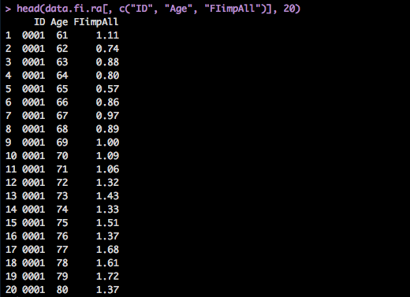
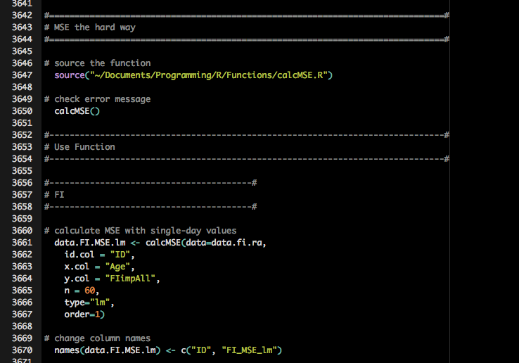

# calcMSE.R

This is a function to calculate the MSE from within animal regressions of 
a y variable (such as Feed Intake) on an x variable (such as Age). 

This trait is supposed to quantify how resilient an animal was to disease. 
The higher averaged squared error (MSE) the less resilient the animal was
during the finishing period. 

This was meant to regress on average daily values, but it can be used
for smaller increments too. 

Input needs:
1) Column to group by (such as an animal ID, factor or character)
2) Column to regress on (such as Age of the animal, numeric)
3) Column to be the y-variable (such as feed intake, numeric)

Here is an example of the datafile:

The following screenshot is from one of my analyses. 

* data is the name of the dataset
* id.col is the column to group by (should be character or factor)
* x.col is the x-variable (numeric)
* y.col is the y-variable (numeric)
* n is the number of datapoints needed to be considered
* type is the analysis type ("lm" or "rq")
* order is for fitting linear, or other degree polynomial (2 for quadratic, 3 for cubic fit, etc)
